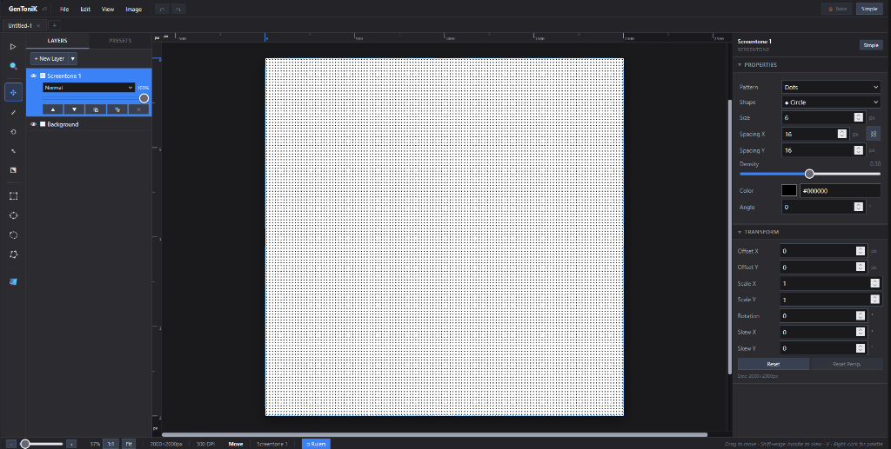

# GenToniK — Многослойный редактор скринтонов

**GenToniK** — это FOSS многослойный растровый редактор скринтонов (точки, штриховка, градиенты) для создания манги, вебтунов и комиксов. Проект построен на стеке React + TypeScript + Vite + WebGL2 / Canvas2D.



---

## 🛠️ Что уже готово (Статус на текущий момент)

1. **Многодокументность и вкладки (Photoshop-style):** Поддержка работы с несколькими открытыми документами, переключение вкладок без потери состояния, диалог создания нового документа с пресетами (A4, B5 Manga, Webtoon Strip) и настройками DPI / фона.
2. **WebGL-композитинг и стабильность:** Высокопроизводительный рендеринг слоев на видеокарте, обработка потери контекста WebGL (restoration), нативный скос (perspective/affine) в шейдерах.
3. **Линейки и скроллбары:** Интегрированы измерительные линейки (пиксели, мм, дюймы), курсор-индикатор и Photoshop-style кастомные скроллбары (с поддержкой колеса мыши и перетаскивания бегунка).
4. **Инструменты трансформации:** Move, Scale, Rotate, Skew (наклон Krita-style по `Shift + Drag`) и Free Transform.
5. **Инструмент Zoom (🔍):** Масштабирование кликом (Alt+клик для отдаления) или выделением рамки (marquee).
6. **Инструмент Bucket Fill (Заливка 🪣):** 5 режимов заливки цветом или скринтоном всего холста/выделенной области.
7. **Bake Transform (Запекание скринтонов):** Конвертация скринтонов с примененными трансформациями в растровые изображения.
8. **Система масок:** Поддержка растровых (layer-local) и векторных (canvas-space) масок из выделения (с выбором режима проецирования).
9. **Прозрачные слои (Transparent):** Добавлен тип пустых прозрачных слоев (`transparent`) для наложения масок и трансформирования.
10. **История (Undo/Redo):** Полноценная отмена/возврат операций, включая восстановление выделений («бегущих муравьев») и физические кнопки на панели.
11. **Совместимость ORA:** Экспорт и импорт проектов в открытый формат OpenRaster (с сохранением структуры слоев, масок и метаданных).

---

## ⚠️ Известные нерешенные проблемы и баги

* ~~**Муар и волны при запекании:** Баг с сохранением тона, а именно возникновение муара (интерполяционных волн) при запекании слоев (`Bake`) и сохранении/экспорте документа, пока **полностью не решён**.~~ (Исправлено в v2.13: реализован алгоритм обратной проекции на CPU с билинейной фильтрацией и scanline-клиппированием для Rasterize и экспорта).
* **Проблемы с горячими клавишами:** До сих пор присутствуют ошибки и конфликты при использовании сложных комбинаций клавиш (включая зажатие клавиш-модификаторов вроде `Ctrl`, `Shift`, `Z` совместно со скроллом).

---

## 📦 Сборка и локальный запуск

> **Важное требование:** Для сборки и запуска проекта на вашем компьютере обязательно должна быть установлена среда выполнения **Node.js** и пакетный менеджер **NPM**. Вы можете скачать их с официального сайта [nodejs.org](https://nodejs.org/).

### 1. Установка зависимостей
Откройте консоль в корневой папке проекта и выполните установку библиотек:
```bash
npm install
```
Если вы разворачиваете проект с нуля, убедитесь в установке ключевых пакетов:
```bash
npm install jszip react-moveable @scena/matrix
```

### 2. Запуск в режиме разработки (Dev-сервер)
Для запуска локального сервера разработки выполните:
```bash
npm run dev
```
После запуска консоль выдаст локальный URL-адрес (обычно `http://localhost:5173/`), откройте его в браузере.

### 3. Сборка для публикации (Production Build)
Чтобы собрать оптимизированный production-бандл (весь проект упаковывается в один готовый HTML-файл), выполните:
```bash
npm run build
```
Готовый бандл будет сохранен в папку `dist/index.html`.

---

## 🗺️ Дорожная карта (Roadmap)

- [ ] **Редизайн пользовательского интерфейса (UI):** Обновление иконок, выравнивание вкладок и панелей настроек, улучшение внешнего вида линеек.
- [ ] **Оптимизация рендеринга (Stage 2-5):** Разработка плиточной системы хранения (tile system), отсечение невидимых областей (viewport culling) и кэширование коммитов.
- [ ] **Продвинутый Undo/Redo:** Переход на паттерн проектирования Command для атомарных и сложных операций над слоями.
- [ ] **Векторные и текстовые слои:** Полноценная реализация текстовых блоков (для диалогов манги) и векторных инструментов (для скоростных линий и панелей).
- [ ] **Доработка Bake Transform:** Поддержка полного запекания для сложных перспективных искажений и вращений.
